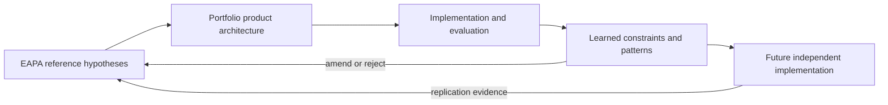
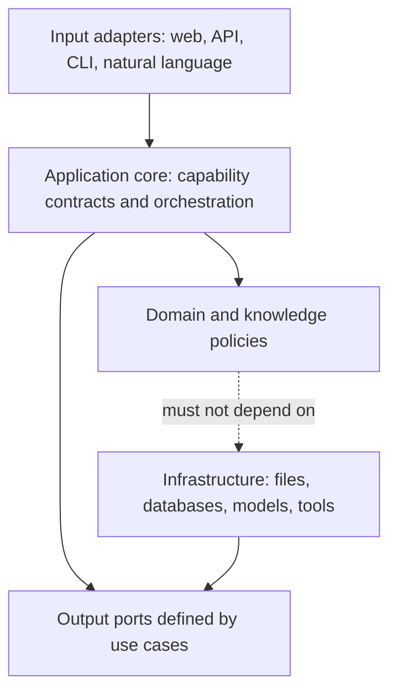

# RFC-000 — Constitución y arquitectura de referencia EAPA

| Campo | Valor |
| --- | --- |
| Estado | Proposed |
| Versión | 0.3 |
| Madurez de evidencia | H1 — Hipótesis falsable |
| Autor | Ernesto Vázquez |
| Fecha | 2026-08-04 |
| Revisión del autor | Aprobada para Proposed — 2026-08-05 |
| Depende de | Nada |
| Habilita | RFC-001 — Engineering Loop y gobernanza de decisiones |

> **La arquitectura no se decreta: se gana con evidencia.**

Las declaraciones `DEBE` y `NO DEBE`, junto con los principios P1–P10, son normativas. Las secciones de hipótesis, alternativas, consecuencias y riesgos preservan el rationale de esta decisión; no crean principios adicionales.

## 1. Resumen

EAPA es el nombre de trabajo de una metodología y arquitectura de referencia para plataformas de ingeniería centradas en conocimiento y habilitadas por IA.

El portfolio de Ernesto es su primera implementación. El portfolio es el producto; EAPA es un medio para construirlo, aprender y demostrar criterio con evidencia.

EAPA no se considera una arquitectura estable ni un meta-framework. Sus principios comienzan como hipótesis y deben madurar mediante implementación, evaluación y replicación.

## 2. Problema

Muchos productos de IA comienzan por seleccionar un modelo, framework de agentes, memoria o base vectorial. El dominio y la evaluación se adaptan después a esas herramientas.

Ese orden puede producir:

- conocimiento atrapado en prompts o formatos de proveedores;
- agentes creados para comportamientos determinísticos;
- memoria sin lifecycle, privacidad ni propósito;
- feedback promovido como verdad sin evaluación;
- decisiones arquitectónicas difíciles de explicar o reemplazar;
- demos técnicamente llamativas que no demuestran criterio de ingeniería.

EAPA busca preservar conocimiento, capacidades y decisiones aunque cambien modelos, frameworks e infraestructura.

## 3. Objetivo real

EAPA solo tiene valor si contribuye a estos resultados:

1. mejorar las capacidades de Ernesto como AI Engineer;
2. demostrar pensamiento de ingeniería mediante un producto real;
3. facilitar software claro, mantenible y evaluable;
4. producir decisiones mejores y trazables;
5. transferir aprendizajes a proyectos futuros.

Si EAPA dificulta construir software, no mejora decisiones o no se refleja en código y evidencia, DEBE simplificarse o descartarse.

## 4. Condiciones de éxito

La arquitectura está aportando valor cuando:

- reduce rework o incertidumbre sin agregar ceremonia desproporcionada;
- dos lectores pueden reconstruir una decisión a partir de problema, evidencia y tradeoffs;
- cada principio aceptado tiene una manifestación verificable en producto, tests o controles;
- el portfolio comunica quién es Ernesto, qué sabe, cómo piensa y qué construyó;
- las abstracciones extraídas sobreviven cambios reales de implementación;
- los aprendizajes conservan alcance, provenance y evidencia contraria.

Cantidad de RFCs, agentes, documentos o capas NO constituye una métrica de éxito.

## 5. Ámbito de aplicabilidad

EAPA está orientada a productos donde:

- el conocimiento curado es un activo central;
- las personas necesitan explorar, explicar, comparar o transformar ese conocimiento;
- la trazabilidad y la evaluación importan;
- la IA puede mejorar capabilities concretas sin convertirse en fuente de verdad;
- existe gobernanza humana sobre publicación y aprendizaje.

EAPA NO afirma resolver por sí sola:

- regulación jurídica, clínica, financiera o de otros dominios críticos;
- sistemas de control autónomo en tiempo real;
- plataformas universales de datos;
- coordinación genérica de agentes;
- necesidades multi-tenant, colaboración, RBAC o billing.

Cada dominio adicional DEBE aportar sus propios modelos, riesgos, políticas y RFCs.

## 6. Arquitectura de referencia e implementación

La arquitectura de referencia describe invariantes candidatas, reglas de dependencia y criterios de evolución.

Una implementación de referencia aplica esas reglas a un producto concreto y contiene decisiones específicas de dominio, framework y despliegue.



El código específico de Ernesto no se generaliza por anticipación. Un patrón reutilizable se extrae solo después de evidencia local y se considera estable únicamente con replicación independiente y reglas de conformidad.

## 7. Cuatro niveles

### 7.1 Constitución y filosofía

Define propósito, principios duraderos y límites éticos. Cambia excepcionalmente mediante una RFC que reemplace esta decisión.

### 7.2 Metodología y gobernanza

Define cómo se comprenden, comparan, deciden, implementan y evalúan los cambios. RFC-001 especifica el Engineering Loop experimental.

### 7.3 Arquitectura de referencia

Define reglas de dependencia, fronteras y patrones respaldados por evidencia. Evoluciona mediante RFCs.

### 7.4 Implementación

Contiene dominio específico, frameworks, adaptadores, datos, configuración y despliegue. Cambia con mayor frecuencia.

Una tecnología puede desaparecer sin invalidar los niveles superiores.

## 8. Dos planos

### 8.1 Engineering plane

Contiene problemas, hipótesis, RFCs, investigaciones, evidencia de evaluación, learning inbox y documentación.

Produce decisiones y amendments candidatos. No sirve tráfico público ni modifica el producto automáticamente.

### 8.2 Product plane

Contiene conocimiento canónico autorizado, capabilities, adaptadores de entrada/salida y presentación.

Sirve resultados a usuarios. Solo cambia mediante decisiones y promociones explícitas del engineering plane.

## 9. Principios normativos

### P1 — Product value first

Toda decisión Significant o Architectural DEBE identificar un outcome de producto y evidencia observable. EAPA es un medio, no el producto.

### P2 — Problem and domain first

El problema y el dominio definen el sistema. Una tecnología NO DEBE crear por sí misma una capability.

### P3 — Knowledge is central

El conocimiento canónico NO DEBE pertenecer a prompts, agentes, modelos ni proveedores. Las proyecciones son regenerables y no son fuente autoritativa.

### P4 — Capabilities before agents

Una capability define un resultado observable independiente de su mecanismo de ejecución. Una función, workflow o agente puede implementarla sin alterar su propósito.

### P5 — Deterministic before probabilistic

El sistema DEBE preferir ejecución determinística cuando satisface el caso de uso. La IA requiere una hipótesis de valor adicional y evaluación específica.

### P6 — Evaluation before learning

Feedback, métricas, memoria y outputs de modelos NO DEBEN modificar conocimiento canónico directamente. Evaluation y aprobación humana median toda promoción.

### P7 — Dependencies point inward

Dominio y contratos de capabilities NO DEBEN depender de presentación, almacenamiento, proveedores o frameworks. Infraestructura implementa puertos definidos por necesidades internas.

### P8 — Provenance and confidentiality by design

Toda afirmación relevante DEBE conservar fuente, autoría, alcance y estado de revisión. Conocimiento público y privado DEBEN permanecer físicamente separados y publicarse de forma fail-closed.

### P9 — Evidence-driven evolution

Las decisiones comienzan como hipótesis. Repetición dispara revisión, no abstracción automática. La madurez se evalúa mediante H0–H3 según RFC-001.

### P10 — Human-governed autonomy

Mayor autonomía exige mayor evaluación, límites, observabilidad y rollback. Un agente NO DEBE autorizar su propio aprendizaje canónico.

## 10. Regla de dependencias

EAPA utiliza una orientación hexagonal sin imponer estructura de carpetas.



Reglas:

1. Los adaptadores traducen interacciones a entradas tipadas.
2. El núcleo de aplicación coordina capabilities; no conoce detalles de transporte o proveedor.
3. El dominio expresa conceptos, invariantes y políticas.
4. Los puertos de salida nacen de casos de uso reales, no de categorías genéricas como `Provider<T>`.
5. Infraestructura depende de contratos internos y puede reemplazarse con impacto localizado.

P7 no prohíbe persistencia ni servicios externos. El núcleo describe qué necesita mediante un puerto; infraestructura decide cómo satisfacerlo. La dependencia prohibida es que el dominio importe o modele detalles concretos de esa implementación.

## 11. Capabilities, reasoning y agents

Una capability DEBE declarar:

- entrada y salida observables;
- errores esperables;
- conocimiento requerido;
- criterios de evaluación;
- políticas de seguridad y confidencialidad.

Reasoning es opcional. Solo participa cuando la capability requiere seleccionar estrategia, descomponer trabajo o resolver incertidumbre que una ruta determinística no puede manejar.

Un agente se justifica únicamente si existe una necesidad demostrada de autonomía, planificación multi-step, herramientas, memoria o colaboración. Un agente no reemplaza una función suficiente.

Multi-agent NO implica distribución entre procesos. La red se introduce solo por escalado, seguridad, disponibilidad o despliegue independiente medidos.

## 12. Knowledge, Memory y Learning

- **Canonical Knowledge:** información aprobada, versionada y trazable dentro de un alcance.
- **Memory:** contexto temporal de conversación o trabajo; no es fuente de verdad.
- **Learning Inbox:** observaciones e hipótesis todavía no verificadas.

La promoción sigue esta política:

```text
Observation
  → Learning Candidate
  → Evaluation
  → Amendment Proposal
  → Human Approval
  → Canonical Knowledge
  → Optional Public Projection
```

Engram pertenece al engineering plane como memoria externa del proceso. El product plane NO DEBE depender de Engram ni asumir acceso público a ese servicio.

## 13. Proveedores e infraestructura

EAPA no define una abstracción universal para LLMs, memoria, embeddings o herramientas.

Cada primera integración DEBE comenzar por el contrato que necesita una capability real. Una segunda implementación permite comparar variaciones; recién entonces se evalúa extraer un puerto más estable.

Las capacidades específicas de un proveedor se exponen mediante contratos explícitos o feature detection. No se empobrecen todas las implementaciones para forzar un mínimo común prematuro.

## 14. Evolución y madurez

RFC-001 distingue tres dimensiones independientes:

- estado de gobernanza de una decisión;
- clase de riesgo del cambio;
- madurez de evidencia H0–H3.

Una RFC aceptada puede seguir en H1. Una hipótesis H2 puede rechazarse por costo o incompatibilidad. H3 es necesaria pero no suficiente para incorporar una regla a EAPA estable.

## 15. Guardrail de entrega

Toda RFC Significant o Architectural DEBE declarar:

- **Product outcome**;
- **Evidence horizon**, con catorce días como valor por defecto;
- **Observable proof**.

El outcome puede ser funcionalidad visible, seguridad, confiabilidad, accesibilidad, mantenibilidad o calidad del conocimiento, siempre que sea verificable.

Una RFC sin outcome cercano permanece en H0, reduce alcance o se difiere.

## 16. Triggers que requieren RFC

Se requiere una RFC cuando cambia al menos uno de estos elementos:

- principios de esta constitución;
- límites, identidades o invariantes del dominio;
- contratos públicos o de capabilities;
- lifecycle, provenance o fuente canónica del conocimiento;
- frontera entre conocimiento público y privado;
- política de autonomía, herramientas o aprendizaje de agentes;
- estrategia de persistencia canónica o migración irreversible;
- topología de despliegue o distribución entre procesos;
- dependencia que condiciona más de una capability o el núcleo.
- cruce de un límite de scope declarado por esta RFC, incluido monoautor a colaboración;
- incorporación de un dominio regulado o de seguridad crítica.

Cambios locales, reversibles y completamente expresables mediante pruebas NO requieren RFC.

## 17. Hipótesis de RFC-000

- **Claim:** estas reglas mínimas permiten evolucionar una plataforma de conocimiento habilitada por IA sin acoplar el núcleo a herramientas ni bloquear entrega de producto.
- **Scope:** primera implementación monoautor orientada a conocimiento de ingeniería.
- **Prediction:** los siguientes cambios pueden entregar outcomes verificables sin introducir abstracciones o proveedores no exigidos por sus casos de uso.
- **Falsifier:** las reglas obligan capas pasantes, retrasan repetidamente features, no resuelven la separación público/privado o requieren excepciones constantes.
- **Evaluation:** aplicar RFC-001 a entre tres y cinco cambios reales y revisar costo, rework, drift y decisiones reutilizadas.
- **Review trigger:** fin del piloto, primer LLM, primera persistencia privada, primer agente o segunda implementación independiente.

## 18. Product outcome de esta RFC

- **Outcome:** establecer límites que permitan diseñar RFC-002 y una primera mejora visible del conocimiento del portfolio sin elegir infraestructura prematuramente.
- **Evidence horizon:** catorce días desde que RFC-000 pase a `Proposed`.
- **Observable proof:** un cambio Significant o Architectural entrega evidencia de producto y puede trazarse a estos principios sin contradicciones ni nuevas capas especulativas.

## 19. Alternativas consideradas

### A. Arquitectura específica del portfolio sin reglas reutilizables

Diferida como única estrategia. Maximiza velocidad inicial, pero no preserva explícitamente conocimiento ni aprendizaje transferible.

### B. Arquitectura universal y completa antes de implementar

Rechazada. Diseña para dominios y riesgos desconocidos, produce BDUF y dificulta falsar decisiones.

### C. Framework de agentes como núcleo

Rechazada. Convierte una herramienta reemplazable en el centro del sistema y empuja autonomía donde puede no ser necesaria.

### D. Arquitectura de referencia evolutiva validada por un producto

Seleccionada. Conserva principios mínimos y permite extraer patrones únicamente desde evidencia real.

## 20. Consecuencias

### Positivas

- El portfolio conserva prioridad sobre la arquitectura.
- Knowledge y capabilities pueden sobrevivir cambios tecnológicos.
- QA y evaluación forman parte del diseño.
- La generalización exige evidencia independiente.
- La documentación se produce junto con decisiones reales.

### Negativas

- Algunas decisiones tardarán más por requerir evidencia explícita.
- El nombre y las fronteras de EAPA pueden cambiar durante el piloto.
- No existe scaffolding ni implementación reusable inmediata.
- El juicio humano sigue siendo necesario para clasificar riesgo y madurez.

## 21. Riesgos y mitigaciones

| Riesgo | Mitigación |
| --- | --- |
| EAPA se convierte en el producto | Product outcome obligatorio y portfolio como primera implementación |
| Documentación sin funcionalidad | Horizonte de evidencia y Engineering Loop proporcional |
| Generalización prematura | H3, segunda implementación y reglas de conformidad |
| IA ornamental | Ejecución determinística primero y evaluación de valor adicional |
| God orchestrator | Capabilities tipadas y reasoning opcional |
| Contaminación de conocimiento | Learning Inbox, Evaluation y aprobación humana |
| Vendor lock-in | Puertos just-in-time definidos por capabilities |
| Filtración de contenido privado | Fuentes físicamente separadas y publicación fail-closed |

## 22. Criterios de aceptación

RFC-000 podrá pasar a `Proposed` cuando:

- su propósito pueda explicarse sin mencionar Astro ni un proveedor;
- el manifiesto, RFC-000 y RFC-001 no se contradigan;
- los principios sean verificables y tengan falsifiers;
- un lector distinga arquitectura de referencia e implementación;
- el alcance excluya honestamente dominios no validados.

Podrá pasar a `Accepted` cuando:

- EL-PILOT-001 esté cerrado;
- al menos un cambio Significant o Architectural pruebe estas reglas;
- el costo del proceso se haya registrado;
- las contradicciones encontradas hayan sido corregidas o diferidas;
- exista un próximo outcome de producto concreto.

## 23. Decisiones diferidas

- Modelo de dominio y conocimiento: RFC-002.
- Lifecycle, provenance y publicación: RFC-003.
- Contratos de capabilities: RFC-004.
- Integración y evaluación de IA: RFC-005, cuando exista un caso real.
- Runtime y orquestación: RFC-006, si varias capabilities lo requieren.
- Arquitectura de agentes: cuando autonomía, planificación, herramientas, memoria o colaboración sean necesidades demostradas.
- Nombre público definitivo de EAPA: después de evidencia H3.

## 24. Triggers de revisión

Esta RFC DEBE revisarse cuando:

- termine el piloto inicial de RFC-001;
- una regla bloquee repetidamente outcomes de producto;
- se implemente la primera capability probabilística;
- se introduzca conocimiento privado persistente;
- se proponga autonomía o aprendizaje automático;
- otra implementación adopte o intente adoptar EAPA y reporte resultados o bloqueos con evidencia;
- evidencia contradictoria reduzca la madurez de un principio.
