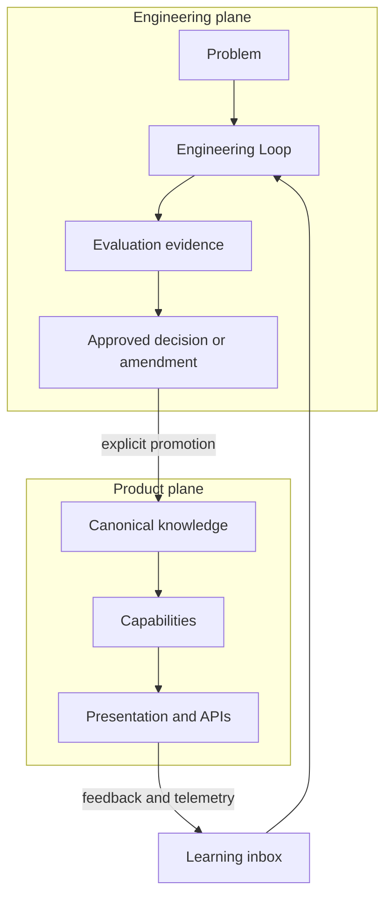
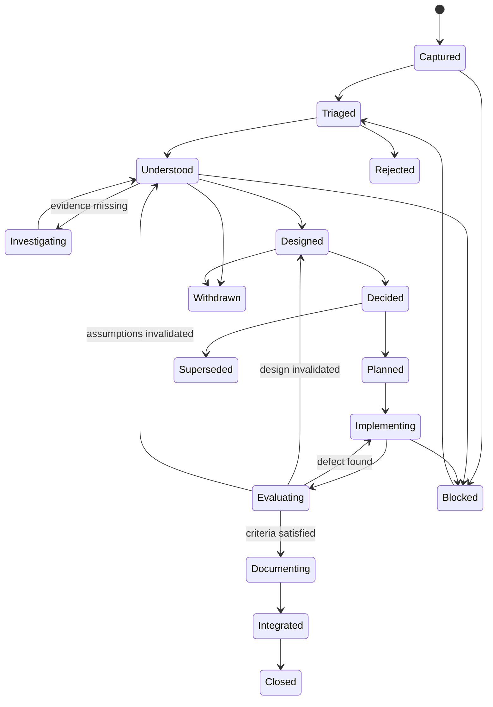
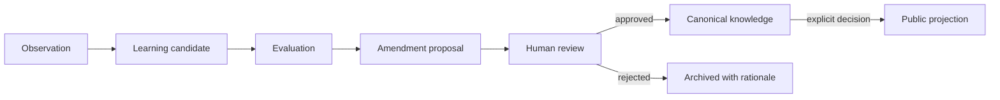
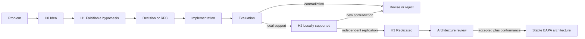

# RFC-001 — Engineering Loop y gobernanza de decisiones

| Campo | Valor |
| --- | --- |
| Estado | Draft / Experimental |
| Madurez de evidencia | H1 — Hipótesis falsable, pendiente de piloto |
| Versión | 0.6 |
| Autor | Ernesto Vázquez |
| Fecha | 2026-08-03 |
| Depende de | RFC-000 — EAPA Constitution and Reference Architecture |
| Reemplaza | Nada |

> Esta RFC no puede pasar a `Accepted` hasta que RFC-000 esté documentada y aceptada.

## 1. Resumen

Engineering Loop define cómo un problema se transforma en una decisión, una implementación validada y conocimiento trazable.

No es un runtime de producto, un agente ni una automatización. Es una metodología del plano de ingeniería que se aplicará manualmente antes de decidir qué partes merecen convertirse en software.

El método es proporcional al riesgo. Una corrección local y reversible no debe recorrer la misma ceremonia que un cambio en seguridad, dominio, contratos públicos o lifecycle del conocimiento.

## 2. Problema

El repositorio puede registrar qué cambió mediante Git, pero todavía no garantiza que preserve:

- qué problema motivó el cambio;
- qué evidencia se utilizó;
- qué alternativas se compararon;
- por qué se eligió una solución;
- cómo se validaron sus consecuencias;
- qué aprendizaje merece convertirse en conocimiento canónico.

Sin un método explícito, las decisiones pueden quedar implícitas en el código, reconstruirse retrospectivamente o producir documentación que no coincide con la implementación.

## 3. Contexto actual

La implementación actual es una aplicación Astro estática con datos TypeScript y una proyección de contexto generada durante el build.

Todavía no existen:

- un modelo de dominio con invariantes explícitas;
- un lifecycle formal de conocimiento;
- agentes o runtime de IA;
- memoria de producto;
- evaluación automatizada de capacidades inteligentes;
- un proceso RFC versionado en el repositorio.

Engineering Loop se introduce antes de esas capacidades para que su diseño y evolución dejen evidencia verificable.

## 4. Drivers

1. Preservar el razonamiento detrás de decisiones importantes.
2. Aplicar esfuerzo proporcional al riesgo.
3. Conectar arquitectura, implementación, QA y documentación.
4. Evitar que feedback u outputs de modelos contaminen conocimiento canónico.
5. Permitir que otra persona comprenda por qué existe cada frontera relevante.
6. Detectar temprano abstracciones innecesarias y decisiones irreversibles.
7. Generar evidencia de aprendizaje sin convertir cada tarea en burocracia.

## 5. Objetivos

- Definir rutas de decisión con criterios verificables.
- Permitir iteraciones, retrocesos, rechazo y abandono explícitos.
- Establecer artefactos mínimos según el riesgo.
- Hacer de Evaluation un gate obligatorio antes de cerrar un cambio.
- Separar observaciones, memoria y conocimiento canónico.
- Pilotar el método manualmente antes de automatizarlo.
- Medir utilidad y costo ceremonial.

## 6. No objetivos

Esta RFC no pretende:

- diseñar el modelo de dominio;
- definir carpetas o paquetes de código;
- elegir frameworks, bases de datos o proveedores de modelos;
- implementar una state machine, dashboard u orquestador;
- automatizar decisiones con IA;
- crear agentes;
- exigir RFC para cambios rutinarios;
- definir procesos para equipos multi-tenant o grandes organizaciones.

## 7. Niveles de decisión

La plataforma distingue cuatro niveles.

### 7.1 Constitución y filosofía

Contiene principios duraderos, límites éticos y reglas de dependencia. Cambia excepcionalmente mediante RFC.

### 7.2 Metodología y gobernanza

Define cómo se investigan, comparan, deciden, validan y aprenden los cambios. Engineering Loop pertenece a este nivel.

### 7.3 Arquitectura de referencia

Define fronteras, dependencias y patrones estructurales del producto. Evoluciona mediante decisiones explícitas.

### 7.4 Implementación

Contiene frameworks, adaptadores, código, configuración y despliegue. Cambia con mayor frecuencia.

Una tecnología puede desaparecer sin invalidar los tres niveles anteriores.

## 8. Engineering plane y product plane

RFC-000, sección 8, define ambos planos. Engineering Loop opera en el engineering plane y solo puede afectar al product plane mediante una decisión o promoción explícita.

## 9. Clasificación proporcional

La ruta se decide por riesgo, no por duración estimada.

### 9.1 Dimensiones de riesgo

- **Reversibilidad:** costo y seguridad de volver atrás.
- **Blast radius:** cantidad de módulos, usuarios o datos afectados.
- **Novedad:** incertidumbre técnica o ausencia de precedentes.
- **Seguridad y confidencialidad:** impacto sobre secretos, privacidad o frontera público/privado.
- **Contratos:** cambios en APIs, esquemas, capabilities o comportamiento público.
- **Persistencia:** riesgo de pérdida, corrupción o migración de datos.
- **Costo operativo:** proveedores, latencia, consumo de modelos o infraestructura.
- **Autonomía:** capacidad del sistema para ejecutar acciones sin aprobación inmediata.
- **Cruce de scope:** abandono de un límite declarado en RFC-000, como monoautor a colaboración o dominio de ingeniería a dominio regulado.
- **Regulación:** incorporación de datos o decisiones sujetos a obligaciones jurídicas, clínicas, financieras o de seguridad crítica.

### 9.2 Ruta Routine

Aplica cuando el cambio es local, reversible y no altera contratos, políticas ni invariantes.

Ejemplos:

- corregir un typo;
- ajustar una etiqueta sin cambiar su semántica;
- reparar un estilo aislado;
- simplificar código preservando comportamiento verificable.

Requiere problema identificable, implementación, verificación y documentación solo si cambia una verdad útil.

### 9.3 Ruta Significant

Aplica cuando cambia comportamiento visible, atraviesa varios módulos, incorpora una dependencia o modifica una representación de datos sin alterar principios fundacionales.

Ejemplos:

- agregar un tipo de documento de conocimiento;
- crear una vista pública nueva;
- incorporar una herramienta de testing;
- cambiar un contrato interno consumido por varias capacidades.

Requiere problem statement, alternativas breves, decision record, PR y evidencia de evaluación.

### 9.4 Ruta Architectural

Aplica si cambia al menos uno de estos elementos:

- principios de RFC-000;
- fronteras o invariantes del dominio;
- contratos públicos o lifecycle del conocimiento;
- separación entre conocimiento público y privado;
- fuente canónica o estrategia de publicación;
- autonomía, permisos o herramientas de agentes;
- topología de despliegue o distribución entre procesos;
- política de proveedores que afecte al núcleo.
- límites de scope declarados en RFC-000;
- entrada en un dominio regulado o de seguridad crítica.

Requiere una RFC completa, estrategia de migración o rollback y validación contra escenarios positivos y negativos.

### 9.5 Ruta Expedited

Es una excepción para incidentes activos o vulnerabilidades.

Permite mitigar antes de completar el análisis, pero exige:

1. verificación inmediata de la mitigación;
2. registro de alcance y riesgo residual;
3. retrospectiva posterior;
4. decision record o RFC si la solución permanente cambia arquitectura.

No puede utilizarse para evitar deliberación normal.

## 10. Reglas de clasificación

1. Cualquier trigger arquitectónico obliga a usar `Architectural`.
2. Sin trigger arquitectónico, un cambio con riesgo relevante en varias dimensiones usa `Significant`.
3. Un cambio localizado, reversible y completamente expresable mediante una prueba puede usar `Routine`.
4. Ante duda entre dos rutas se comienza por la de mayor rigor y se puede reclasificar dejando rationale.
5. La clasificación puede cambiar al descubrir nueva evidencia.
6. Cruzar un límite de scope o ingresar en un dominio regulado obliga a usar `Architectural` y obtener revisión experta del dominio cuando corresponda.

## 11. Estados del loop

El loop es un grafo. No todas las etapas son obligatorias y Evaluation puede devolver el trabajo a etapas anteriores.

Los estados describen progreso conceptual. No implican que deba existir una entidad persistida o un servicio por estado.

## 12. Etapas y criterios

| Etapa | Pregunta principal | Salida posible |
| --- | --- | --- |
| Capture | ¿Qué problema observable existe y para quién? | Problem statement |
| Triage | ¿Qué riesgo y ruta corresponden? | Clasificación con rationale |
| Understand | ¿Cuáles son contexto, restricciones, causas y no objetivos? | Understanding notes |
| Investigate | ¿Qué evidencia falta para decidir? | Evidence pack o experimento time-boxed |
| Design | ¿Qué alternativas reales existen? | Opciones y tradeoffs |
| Decide | ¿Qué elegimos y qué consecuencias aceptamos? | Decision record o RFC |
| Plan | ¿Cuál es el cambio mínimo validable y cómo vuelve atrás? | Plan y criterios de aceptación |
| Implement | ¿El cambio sigue la decisión aprobada? | PR o changeset |
| Evaluate | ¿La evidencia demuestra que resolvimos el problema sin violar límites? | Evaluation evidence |
| Document | ¿Qué verdad o contrato cambió? | Documentación o knowledge amendment |
| Reflect | ¿Qué predicción acertó, falló o debe revisarse? | Learning candidate |

## 13. Artefactos por ruta

| Artefacto | Routine | Significant | Architectural | Expedited |
| --- | --- | --- | --- | --- |
| Problem statement | Breve | Obligatorio | Obligatorio | Breve inicialmente |
| Clasificación | Implícita o breve | Obligatoria | Obligatoria | Obligatoria después |
| Evidence pack | Si hace falta | Según incertidumbre | Obligatorio | Después de mitigar |
| Alternativas y tradeoffs | No | Breve | Obligatorio | Para solución permanente |
| Decision record | No | Obligatorio | Incluido en RFC | Posterior si aplica |
| RFC | No | No | Obligatoria | Posterior si aplica |
| Evaluation evidence | Obligatoria | Obligatoria | Obligatoria | Inmediata |
| Knowledge amendment | Solo si cambia una verdad | Si aplica | Obligatorio si cambia conocimiento | Después de revisión |
| Capability contract | Solo si crea o cambia una capability | Obligatorio si crea o cambia una capability | Obligatorio si crea o cambia una capability | Para la solución permanente, si aplica |

En la primera versión, el decision record de una ruta Significant puede vivir en la descripción del PR. No se crea un archivo por decisión sin necesidad demostrada.

## 14. Entry y exit criteria

### Entry criteria

Todo cambio debe tener:

- un problema o necesidad identificable;
- un actor o consumidor afectado;
- evidencia inicial suficiente para clasificarlo;
- límites de confidencialidad conocidos.

### Exit criteria comunes

Un cambio solo puede cerrarse cuando:

- sus criterios de aceptación fueron evaluados;
- la evidencia de evaluación es trazable;
- no quedan cambios arquitectónicos silenciosos;
- la documentación afectada refleja el comportamiento real;
- cualquier aprendizaje permanece en inbox o fue promovido explícitamente;
- riesgos residuales y decisiones diferidas están registrados.

## 15. Evaluation como gate

Evaluation no es sinónimo de ejecutar tests. Selecciona evidencia según el riesgo:

- tests unitarios, integración o E2E;
- revisión de tipos y contratos;
- análisis de seguridad y confidencialidad;
- pruebas de migración o rollback;
- métricas de rendimiento y costo;
- evaluaciones de groundedness, relevancia y seguridad para IA;
- revisión humana cuando el resultado no puede verificarse mecánicamente.

Un output exitoso no demuestra por sí solo que el diseño sea correcto. La evaluación debe contrastar criterios definidos antes de implementar.

## 16. Knowledge, Memory y Learning

### Canonical Knowledge

Información aprobada, versionada, con provenance y apta para ser consumida como fuente de verdad dentro de su alcance.

### Learning Inbox

Observaciones, feedback, resultados experimentales e hipótesis todavía no verificadas.

### Memory

Contexto temporal de una conversación o proceso de ingeniería. Engram pertenece a esta categoría y no es una dependencia del runtime público.

### Promoción

Ningún feedback, métrica, memory entry u output de modelo modifica Canonical Knowledge automáticamente.

Toda promoción aprobada conserva:

- fuente;
- autoría;
- timestamp;
- método de evaluación;
- aprobador;
- alcance público o privado.

## 17. Mapa provisional de responsabilidades

Los nombres siguientes son hipótesis conceptuales. Esta RFC no aprueba engines como servicios, módulos o unidades de despliegue.

| Responsabilidad | Límite |
| --- | --- |
| Knowledge | Organiza y expone conocimiento canónico; no razona |
| Reasoning | Selecciona estrategia o plan cuando una capability lo necesita; no es un cerebro central obligatorio |
| Execution | Ejecuta capabilities o planes y controla errores, timeouts, idempotencia y cancelación; no decide políticas de negocio |
| Learning | Captura observaciones y propone amendments; no modifica conocimiento |
| Evaluation | Gate transversal que valida outputs y propuestas |
| Governance | Responsabilidad del engineering plane que acepta decisiones y promociones |
| Observability | Produce evidencia; no define verdad ni decisiones |

Una capability determinista puede omitir Reasoning y modelos por completo.

Cuando un cambio crea o modifica una capability, su contrato observable incluye entrada, salida, errores esperados, conocimiento requerido, evaluación y políticas de seguridad. RFC-004 definirá su representación solo después de contar con un caso real.

## 18. Anti-ceremonial charter

No se crea una RFC cuando:

- el cambio es local y reversible;
- no modifica contratos, invariantes ni políticas;
- una prueba expresa completamente la decisión;
- una decisión aceptada ya cubre el caso.

Reglas adicionales:

1. No investigar cuando ya existe evidencia suficiente; registrar por qué se omite.
2. No fabricar alternativas si una restricción deja una sola opción válida.
3. No medir calidad por cantidad de documentos, etapas o palabras.
4. Eliminar artifacts que no habiliten una decisión, reduzcan riesgo o preserven conocimiento.
5. No reescribir una RFC aceptada para ocultar evolución; crear una RFC que la reemplace.
6. Revisar periódicamente drift entre decisión, implementación y documentación.
7. Toda RFC nace de un problema y una decisión pendiente reales, no de una abstracción desanclada.
8. La tercera implementación independientemente motivada del mismo patrón, respaldada por referencias trazables, obliga a revisar si merece extracción; no lo convierte automáticamente en arquitectura.

### 18.1 Product value guardrail

El portfolio es el producto; EAPA es un medio para construirlo y aprender con mayor rigor.

Toda RFC `Significant` o `Architectural` debe declarar:

- **Product outcome:** qué mejora habilita para un visitante, el autor o la operación del producto.
- **Evidence horizon:** cuándo se espera observar evidencia; catorce días es el valor por defecto.
- **Observable proof:** funcionalidad, test, métrica, evaluación o reducción de riesgo que permitirá juzgar el resultado.

Una mejora no necesita ser visual. Seguridad, confiabilidad, accesibilidad, mantenibilidad y calidad del conocimiento cuentan cuando su efecto es verificable.

Si una RFC no puede identificar un outcome y una prueba cercanos, permanece en H0, se reduce de alcance o se difiere. Extender el horizonte requiere rationale explícito; no se acepta como excepción automática por tratarse de arquitectura.

## 19. Hipótesis y madurez de evidencia

El estado de una RFC, el riesgo de un cambio y la madurez de su evidencia son dimensiones independientes.

- **Estado de gobernanza:** `Draft`, `Proposed`, `Accepted`, `Implemented`, `Rejected`, `Withdrawn` o `Superseded`.
- **Clase de riesgo:** `Routine`, `Significant`, `Architectural` o `Expedited`.
- **Madurez de evidencia:** `H0`, `H1`, `H2` o `H3`.

Una RFC puede ser aceptada condicionalmente para ejecutar un experimento y seguir en H1. Del mismo modo, una observación H2 puede no adoptarse por costo, seguridad o incompatibilidad con otros principios.

### 19.1 Escala de madurez

| Nivel | Nombre | Criterio |
| --- | --- | --- |
| H0 | Idea | Intuición o posibilidad todavía sin afirmación falsable ni plan de evaluación |
| H1 | Hipótesis | Define alcance, predicción, criterio que podría refutarla y método de evaluación |
| H2 | Respaldada localmente | Fue implementada y evaluada en este repositorio contra criterios declarados; conserva límites y evidencia contraria |
| H3 | Replicada | Fue respaldada en implementaciones o contextos materialmente independientes y se conocen invariantes y puntos de variación |

`Validada` no significa verdadera universalmente. Por eso H2 se denomina `Respaldada localmente` y H3 `Replicada`, no `Generalizada`.

### 19.2 Registro mínimo de una hipótesis

Toda H1 o superior declara:

- **Claim:** qué se espera que sea cierto.
- **Scope:** dónde aplica y dónde no.
- **Prediction:** qué resultado observable se espera.
- **Falsifier:** qué evidencia obligaría a rechazarla o revisarla.
- **Evaluation:** cómo se obtendrá evidencia.
- **Evidence:** resultados, condiciones y limitaciones.
- **Review trigger:** cuándo debe reexaminarse.

### 19.3 Promoción y regresión

La madurez no es monotónica ni automática:

1. H0 pasa a H1 cuando la idea se vuelve falsable.
2. H1 pasa a H2 solo después de implementación y evaluación local.
3. H2 pasa a H3 únicamente con evidencia independiente y análisis de variabilidad.
4. Evidencia contradictoria puede reducir la madurez, limitar el scope o rechazar la hipótesis.
5. Tres apariciones dentro del mismo sistema disparan una revisión arquitectónica, pero pueden seguir siendo una particularidad local H2.
6. Una decisión solo se considera parte estable de EAPA cuando, además de alcanzar H3, tiene una RFC aceptada, reglas de conformidad y costo operativo sostenible.

## 20. Piloto experimental

Antes de automatizar el método se aplicará manualmente a entre tres y cinco cambios reales.

El piloto debe incluir al menos:

1. un cambio Routine;
2. un cambio Significant en el futuro Knowledge Layer;
3. una decisión Architectural, como RFC-002 Domain and Knowledge Model.

Para cada cambio se registrará:

- clasificación y rationale;
- madurez inicial y final;
- claim, predicción y falsifier cuando sea H1 o superior;
- lead time;
- rework provocado por supuestos incorrectos;
- defectos o criterios incumplidos;
- artifacts creados y posteriormente consultados;
- drift detectado;
- etapas omitidas y motivo.

Después del piloto se eliminarán o simplificarán las partes que no hayan modificado decisiones ni reducido riesgos.

### 20.1 EL-PILOT-001 — Corregir narrativa agent-ready

Como instrumento experimental, este piloto captura outcome, horizonte y prueba aunque la ruta Routine no los exija. Son telemetría del piloto, no nuevos artefactos obligatorios para todos los cambios Routine.

| Campo | Resultado |
| --- | --- |
| Fecha | 2026-08-04 |
| Ruta | Routine |
| Estado | Closed |
| Problema | README y configuración afirmaban que el runtime de agentes estaba preparado y recomendaban `output: 'hybrid'` |
| Hipótesis | Una descripción fiel del estado actual reduce drift y evita implementar desde supuestos obsoletos |
| Product outcome | Reclutadores y mantenedores distinguen producto actual, experimento de contexto y trabajo futuro |
| Evidence horizon | Mismo día |
| Observable proof | No quedan instrucciones `hybrid` ni claims de arquitectura de agentes terminada; diagnósticos sin errores |
| Artifacts | Cambios en README y configuración; sin RFC adicional ni decision record |
| Resultado | Implementación completada; exactitud, enlaces y formato verificados |
| Madurez | Exactitud técnica H2 local; comprensión externa H1 pendiente de lectores reales |

Este piloto respalda que una ruta Routine puede preservar trazabilidad sin crear un documento adicional. Todavía no demuestra que el manifiesto o la nueva narrativa mejoren la comprensión externa.

### 20.2 EL-PILOT-002 — Publicar el primer caso de estudio

| Campo | Resultado |
| --- | --- |
| Fecha | 2026-08-05 |
| Ruta | Significant |
| Estado | Evaluating |
| Problema | Las tarjetas de proyectos mostraban qué fue construido, pero no permitían reconstruir cómo se analizó y validó una decisión |
| Hipótesis | Un caso estructurado permite comprender problema, alternativas, decisión, implementación, evidencia y aprendizaje en menos de diez minutos |
| Prediction | Un lector puede recorrer el caso desde la tarjeta del portfolio, cambiar de idioma y distinguir evidencia H2 de afirmaciones H1 |
| Falsifier | La navegación falla, el contenido no entra en mobile, las etapas no pueden identificarse o lectores reales no reconstruyen la decisión |
| Product outcome | Primer caso de estudio público y bilingüe enlazado desde el proyecto Portfolio |
| Evidence horizon | Catorce días |
| Observable proof | Rutas EN/ES, switch de idioma, nueve etapas semánticas, enlace desde landing, cero overflow y cero errores de consola en desktop/mobile |
| Alternativas | Página hardcodeada; Content Collection; catálogo TypeScript específico del producto |
| Decisión | Catálogo tipado + plantilla compartida + `getStaticPaths`; diferir Content Collections hasta observar repetición editorial |
| Artifacts | Contenido bilingüe, plantilla Astro, dos rutas estáticas, enlace en Projects y evidencia Playwright |
| Rework | La validación detectó rótulos visuales sin heading semántico y un detalle interno sin valor público; ambos fueron corregidos |
| Resultado | Funcionalidad y responsive respaldados localmente; comprensión de recruiters aún no evaluada |
| Madurez | Implementación H2 local; hipótesis de comunicación H1 |

Este piloto respalda separar contenido de plantilla sin introducir CMS, base de datos o framework frontend. No demuestra todavía que el contrato `CaseStudy` sea una abstracción estable ni que Content Collections sean innecesarias con varios casos.

### 20.3 EL-PILOT-003 — Ejecutar conocimiento público sin LLM

| Campo | Resultado |
| --- | --- |
| Fecha | 2026-08-05 |
| Ruta | Significant |
| Estado | Evaluating |
| Problema | El portfolio publicaba conocimiento y casos de estudio, pero el sistema no podía ejecutar una capability sobre ellos |
| Hipótesis | Retrieval determinístico sobre registros públicos tipados puede responder preguntas conocidas con evidencia y rechazar afirmaciones no publicadas sin usar LLM |
| Prediction | Consultas EN/ES recuperan rol, proyectos, decisiones y evidencia; Astro vs. Next retorna `insufficient`; cada respuesta distingue match confidence de madurez H1/H2 |
| Falsifier | Una consulta soportada devuelve un registro incorrecto, una pregunta no documentada recibe una respuesta afirmativa, faltan referencias o la interfaz falla en mobile/teclado |
| Product outcome | Knowledge Explorer visible con respuestas grounded, confidence, evidencia y fuentes |
| Evidence horizon | Mismo día para comportamiento local; catorce días para comprensión con lectores |
| Observable proof | Trece tests unitarios, consultas EN/ES, rechazo Astro/Next, navegación por teclado y mobile/desktop sin overflow ni errores de consola |
| Alternativas | FAQ fija; ranking determinístico tipado; RAG/LLM |
| Decisión | Implementar `QueryPortfolioKnowledge` como función pura y catálogo público específico; diferir LLM, memory y provider abstraction |
| Artifacts | Contrato tipado, registros públicos, ranking, Vitest, interfaz Astro y navegación |
| Rework | Se separó match confidence de evidence maturity y se ajustó el scroll suave en la estrategia de prueba |
| Resultado | Capability y grounding respaldados localmente; utilidad para recruiters todavía no medida |
| Madurez | Implementación H2 local; hipótesis de valor para lectores H1 |

Este piloto demuestra que una capability visible puede preceder a providers y agentes. No demuestra que el ranking actual escale a un corpus grande ni que constituya un Knowledge Engine reusable.

### 20.4 EL-PILOT-004 — Trazar skills a evidencia pública

| Campo | Resultado |
| --- | --- |
| Fecha | 2026-08-26 |
| Ruta | Significant |
| Estado | Evaluating |
| Problema | El catálogo de skills lista afirmaciones (claims) sin mostrar qué evidencia pública las respalda; un recruiter no puede distinguir lo probado de lo autodeclarado |
| Hipótesis | Un mapa curado skill → evidencia, con madurez H1/H2 explícita y fail-closed para skills sin prueba, comunica honestidad técnica mejor que una lista de tags |
| Prediction | Cada skill del catálogo resuelve a `traced` (con nodos H2 de artefactos públicos y/o H1 autodeclarados) o `untraced`; ninguna evidencia se infiere automáticamente |
| Falsifier | Una skill sin evidencia curada devuelve nodos fabricados; un enlace usa esquema no permitido; la red SVG rompe layout en mobile o anima bajo `prefers-reduced-motion` |
| Product outcome | Sección Skill Evidence con red SVG interactiva EN/ES; skills sin prueba pública (Docker, GitHub Actions, TestNG, AI in QA) se muestran como `untraced` por diseño |
| Evidence horizon | Mismo día para comportamiento local; catorce días para comprensión con lectores |
| Observable proof | Tests de trazado, fail-closed, locale ES y hrefs seguros; build estático con ambas homepages |
| Alternativas | Derivar evidencia cruzando tags de `skills.ts` × `projects.ts` × `experience.ts`; mapa curado explícito |
| Decisión | Mapa curado explícito: la derivación automática fabricaría vínculos débiles y ocultaría la diferencia entre skill declarada y probada |
| Artifacts | `features/skill-evidence/` (contrato + capability), `SkillGraph.astro`, tests |
| Resultado | Capability y UI respaldados localmente; percepción de recruiters aún no medida |
| Madurez | Implementación H2 local; hipótesis de comunicación H1 |

Este piloto habilita la observación de invariantes entre dos capabilities (`QueryPortfolioKnowledge` y `TraceSkillEvidence`) antes de extraer cualquier contrato compartido. No demuestra que el formato de red radial sea la mejor visualización ni que el mapa curado escale a catálogos grandes.

### 20.5 EL-PILOT-005 — Internacionalización estática EN/ES

| Campo | Resultado |
| --- | --- |
| Fecha | 2026-08-26 |
| Ruta | Routine |
| Estado | Evaluating |
| Problema | El portfolio solo existía en inglés; la audiencia hispanohablante (Argentina/LATAM) no tenía una versión nativa y el contenido ES de los case studies no tenía homepage |
| Hipótesis | Un overlay de contenido tipado sobre los datos canónicos EN permite una versión ES completa sin duplicar markup ni divergir en estructura |
| Product outcome | Homepage `/es/` completa, switch de idioma en Header, capabilities respondiendo en el locale de la página |
| Evidence horizon | Mismo día |
| Observable proof | Test de paridad de claves EN/ES (misma estructura, sin strings vacíos), overlays sin perder campos estructurales, build genera `/es/index.html` |
| Alternativas | Páginas duplicadas por idioma; librería i18n externa; overlay tipado sobre datos canónicos |
| Decisión | Overlay tipado (`i18n/content.ts` + `i18n/ui.ts`): las claves estables (company, project id, category) actúan de join key y la paridad queda verificada por tests |
| Artifacts | `i18n/` (locale, ui, content), prop `locale` en componentes, `es/index.astro`, tests de paridad |
| Resultado | Paridad estructural verificada por tests; calidad de las traducciones pendiente de lectores nativos |
| Madurez | Implementación H2 local; calidad lingüística H1 |

## 21. Criterios de aceptación

RFC-001 podrá pasar a `Proposed` cuando:

- las cuatro rutas puedan aplicarse sin tooling propietario ni LLM;
- los ejemplos permitan clasificar cambios sin ambigüedad material;
- Evaluation bloquee toda promoción a Canonical Knowledge;
- Engineering plane y product plane estén claramente separados;
- el piloto tenga evidencia para tres o más cambios;
- las hipótesis del piloto tengan predicciones y falsifiers evaluables;
- cada cambio Significant o Architectural del piloto declare outcome, horizonte y prueba observable;
- se haya medido el costo del proceso;
- exista una retrospectiva con ajustes propuestos.

Podrá pasar a `Accepted` cuando:

- RFC-000 esté aceptada;
- las contradicciones con RFC-000 estén resueltas;
- el piloto muestre mejor trazabilidad o detección de riesgo;
- el costo ceremonial sea aceptable para el autor;
- las decisiones diferidas estén explícitas.

## 22. Métricas de utilidad

Las métricas orientan revisión; no son objetivos para optimizar artificialmente.

- porcentaje de cambios correctamente trazados a un problema;
- decisiones reutilizadas o citadas;
- rework por comprensión incompleta;
- defectos escapados por clase de riesgo;
- tiempo invertido en artifacts;
- artifacts nunca consultados;
- drift entre RFC, código y documentación;
- cambios de clasificación durante el loop;
- hipótesis promovidas, limitadas, rechazadas o sin evidencia suficiente.

La primera prueba establece baseline. Esta RFC no inventa umbrales sin datos.

## 23. Alternativas consideradas

### A. Pipeline completo para todos los cambios

Rechazada. Maximiza consistencia aparente, pero genera burocracia y desalienta mantenimiento pequeño.

### B. Decisiones ad hoc mediante commits y PRs

Rechazada como política general. Es suficiente para cambios rutinarios, pero pierde contexto y alternativas en decisiones importantes.

### C. Implementar inmediatamente una state machine

Diferida. Automatizar un proceso no validado congelaría supuestos y agregaría una segunda aplicación antes de entender el dominio.

### D. Método proporcional manual antes de automatizar

Seleccionada. Preserva rigor donde hay riesgo y permite aprender qué tooling aporta valor real.

## 24. Consecuencias

### Positivas

- El razonamiento queda conectado con implementación y evidencia.
- QA forma parte de la decisión, no una fase tardía.
- Los cambios pequeños conservan velocidad.
- Learning no contamina conocimiento automáticamente.
- La futura automatización se basa en fricción observada.

### Negativas

- Las decisiones Significant y Architectural requieren más disciplina.
- La clasificación contiene juicio humano y puede cambiar.
- El piloto retrasa deliberadamente la automatización.
- Mantener trazabilidad exige revisión periódica.
- La madurez epistemológica agrega una dimensión que debe mantenerse separada del estado administrativo.

## 25. Riesgos y mitigaciones

| Riesgo | Mitigación |
| --- | --- |
| RFC-itis | Rutas proporcionales y anti-ceremonial charter |
| Clasificación inconsistente | Criterios, ejemplos y rationale versionado |
| Learning contamina Knowledge | Evaluation, amendment y aprobación humana |
| Documentación diverge | Exit criteria y revisiones de drift |
| Reasoning se convierte en god object | Capabilities deterministas primero; reasoning opcional |
| Tooling congela un proceso inmaduro | Piloto manual antes de automatizar |
| Exposición de información privada | Separación física y publicación fail-closed definida por RFC posterior |
| H2 se comunica como verdad universal | Registrar scope, falsifier y limitaciones; reservar H3 para replicación independiente |
| Regla de tres produce abstracciones prematuras | Usarla como trigger de revisión, nunca como promoción automática |

## 26. Seguridad y confidencialidad

- Ningún artifact debe reproducir código, workflows, documentos o lógica propietaria.
- Evidence packs deben referenciar únicamente material autorizado.
- Learning Inbox y memoria de ingeniería se consideran privadas por defecto.
- Secretos, credenciales y contenido propietario se excluyen de Engram y de cualquier memoria de ingeniería.
- La publicación es una promoción explícita, nunca un filtro optimista en runtime.
- Cambiar la frontera público/privado siempre usa ruta Architectural.

## 27. Decisiones diferidas

- Modelo de dominio y conocimiento: RFC-002.
- Lifecycle, provenance y publicación: RFC-003.
- Contratos de capabilities: RFC-004.
- Integración y evaluación de IA: RFC-005, al existir un caso real.
- Runtime y orquestación: RFC-006, si varias capabilities lo requieren.
- Arquitectura de agentes: solo cuando autonomía, planificación, herramientas, memoria o colaboración estén demostradas.
- Formato y ubicación definitiva de decision records Significant: después del piloto.
- Automatización CI del loop: después de identificar checks repetitivos.
- Lifecycle y retención de memoria de ingeniería: cuando exista un problema real de recuperación, privacidad o costo que permita evaluarlos.

## 28. Triggers de revisión

Esta RFC debe revisarse cuando:

- termine el piloto inicial;
- una clasificación produzca riesgo material o burocracia repetida;
- se implemente la primera capability con IA;
- se proponga aprendizaje automático o promoción sin revisión humana;
- otra implementación adopte o intente adoptar el método y reporte resultados o bloqueos con evidencia;
- se diseñe tooling de conformidad;
- una hipótesis cambie de H2 a H3 o reciba evidencia contradictoria;
- cambie RFC-000.

## 29. Camino hacia un meta-framework

El proyecto solo adoptará públicamente esa categoría cuando existan:

1. al menos dos aplicaciones independientes;
2. vocabulario y reglas de conformidad verificables;
3. templates o tooling reutilizables;
4. extension points validados por casos reales;
5. versionado y compatibilidad explícitos;
6. guía de adopción y migración;
7. evidencia de que el método mejora resultados fuera de esta instancia.

H3 es necesaria, pero no suficiente, para esta promoción. Hasta entonces, la descripción correcta es **metodología de ingeniería y arquitectura de referencia**.
